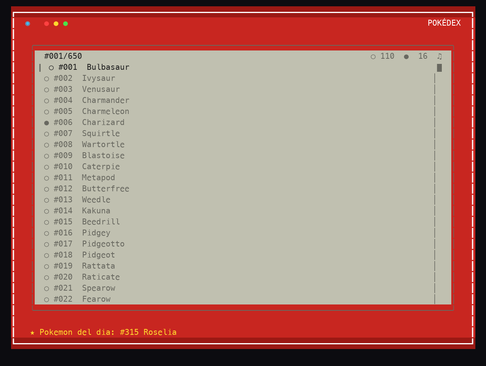

<div align="center">



# 🔴 Pokédex Nacional CLI

**Una Pokédex interactiva para tu terminal con los Pokémon #001 al #649 (Generaciones I-V): sprites, gritos, minijuegos y mucho más.**


</div>

---

## Qué es esto

Una Pokédex Nacional completa que vive en tu terminal. Recorre la lista de los 649 Pokémon de las Generaciones I a V, mira sus sprites renderizados en caracteres, escucha sus gritos y pon a prueba tus conocimientos con varios minijuegos. Los datos vienen de **PokeAPI** y se cachean localmente, así que tras la primera carga puedes consultarla sin conexión.

- 📖 Pokédex completa de las Generaciones I-V (#001-#649).
- 🖼️ Sprites e iconos renderizados directamente en la terminal (vía Pillow).
- 🔊 Gritos de los Pokémon y efectos de sonido (con opción de silenciar).
- 🎨 Varias paletas de color intercambiables al vuelo.
- 🧠 Modo quiz (silueta y grito) para retarte.
- 🌿 Safari Zone para capturar Pokémon.
- 🏆 Gym Challenge: combates contra líderes de gimnasio.
- 🃏 Minijuego de memoria con tarjetas estilo PC.
- 💾 Caché local de sprites, gritos y datos para uso offline.
- 🪪 Exportación de tu Trainer Card.

## 🎮 Cómo se juega

| Tecla | Acción |
| --- | --- |
| Flechas · `j`/`k` · `w`/`s` | Moverse por las listas |
| `ENTER` | Abrir / seleccionar / continuar |
| `/` | Buscar Pokémon por nombre |
| `g` | Menú de quiz |
| `h` | Safari Zone |
| `B` | Gym Challenge |
| `M` | Minijuego de memoria |
| `p` | Cambiar de paleta de color |
| `m` | Silenciar / activar audio |
| `T` | Exportar Trainer Card |
| `?` | Ayuda |
| `q` / `ESC` | Volver / salir |

## 🚀 Cómo ejecutar

```bash
python3 -m venv .venv
source .venv/bin/activate
python3 -m pip install -e ".[dev]"

python3 pokedex_gen1.py
```

Si solo quieres las dependencias de ejecución:

```bash
python3 -m pip install -r pokedex_requirements.txt
```

Comandos directos por línea de órdenes:

```bash
python3 pokedex_gen1.py --pokemon pikachu   # Ver un Pokémon concreto
python3 pokedex_gen1.py --quiz              # Modo quiz
python3 pokedex_gen1.py --safari            # Safari Zone
python3 pokedex_gen1.py --gym               # Gym Challenge
python3 pokedex_gen1.py --stats             # Estadísticas
python3 pokedex_gen1.py --trainer-card      # Exportar Trainer Card
python3 pokedex_gen1.py --cache-status      # Estado de la caché
python3 pokedex_gen1.py --prefetch          # Precargar datos para uso offline
```

## 🛠️ Bajo el capó

- **Python 3.9+** como lenguaje principal.
- **Pillow** para el renderizado de sprites e iconos en la terminal.
- **certifi** para las conexiones TLS con PokeAPI / Showdown.
- Datos obtenidos de **PokeAPI** y cacheados localmente, con prefetch en segundo plano para que navegar nunca espere a la red.
- Tests con **pytest** y linting con **ruff**; empaquetado con `pyproject.toml`.

## 📦 Créditos

Hecho por [@gavilanbe](https://github.com/gavilanbe). Datos de [PokeAPI](https://pokeapi.co/). Uno más de mi colección de juegos de terminal. 🚀

## 📄 Licencia

[MIT](LICENSE)
